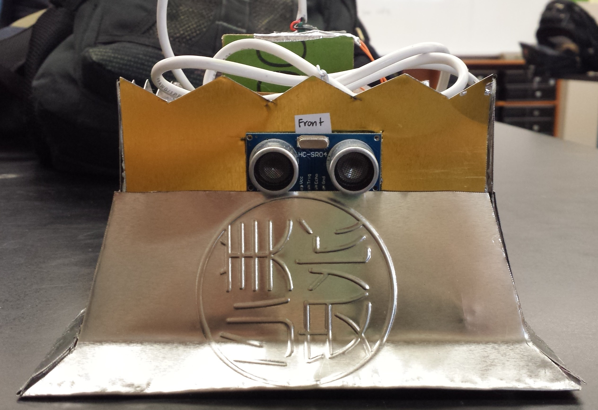
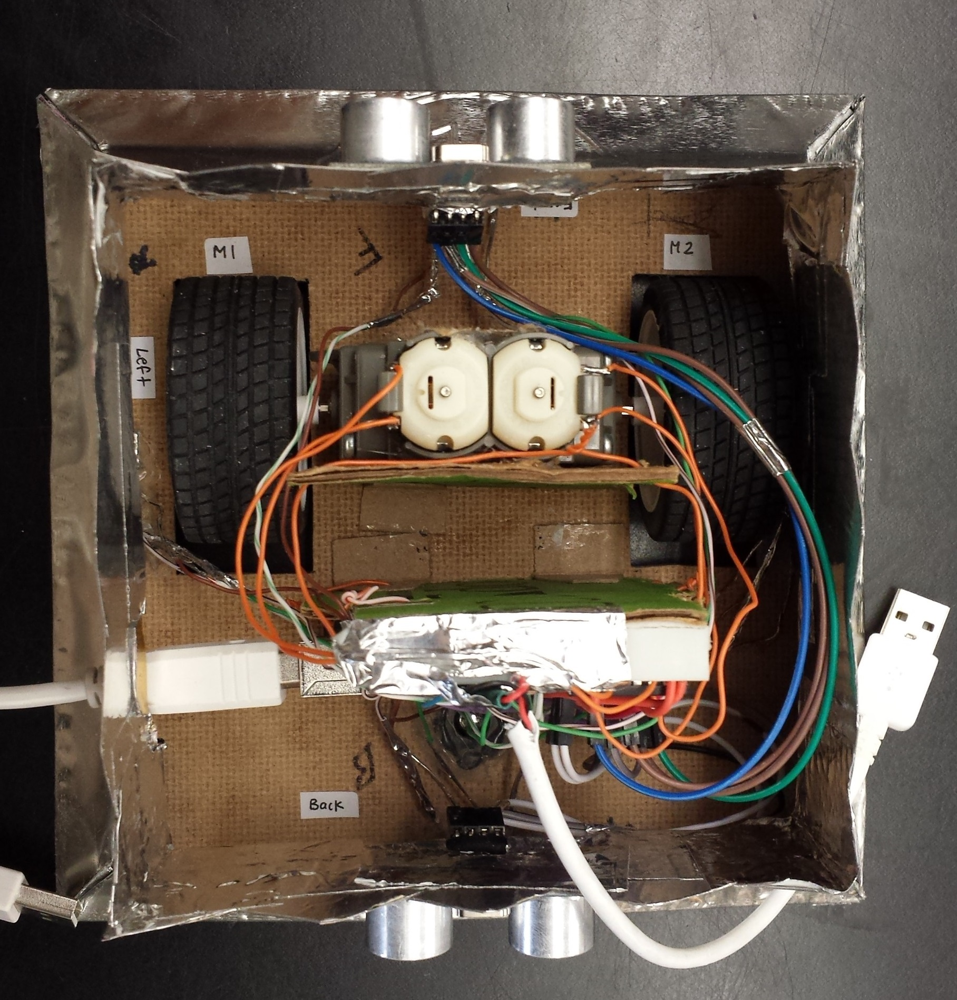
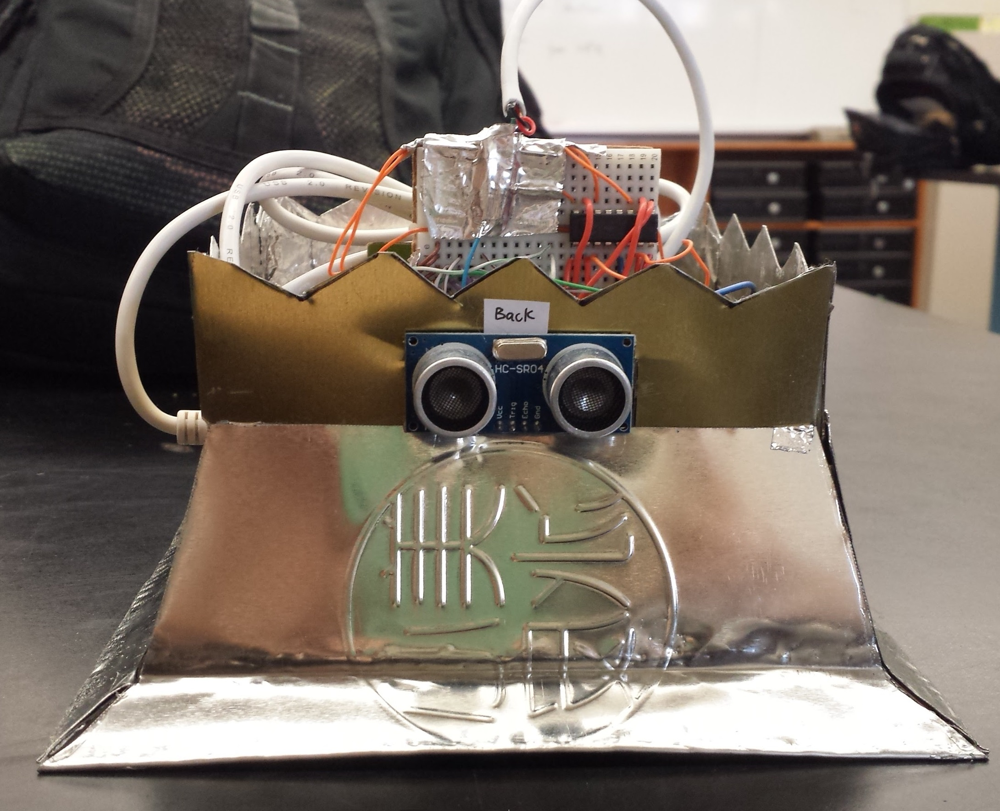

# SumoBot

A Sumbot built from metal sheets, a wood base, ultrasonic sensors, IR sensors, a Tamiya gearbox, wheels, and an Arduino Uno. Powered by a portable power bank, this SumoBot went on to win a tournament against 9 other teams.

Watch the SumBot in action <a href="https://youtu.be/EKj6bLQV2Hk">here</a>.

